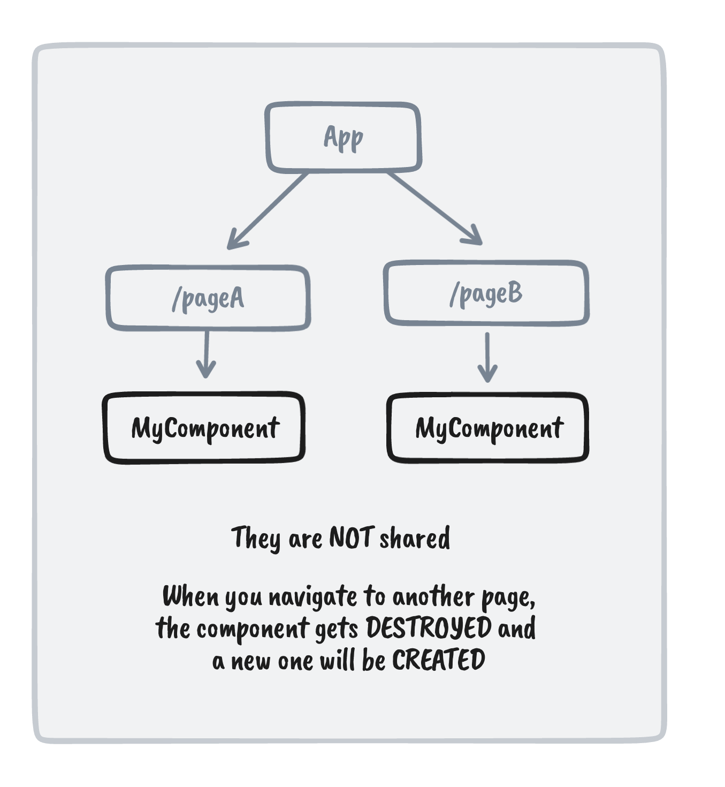
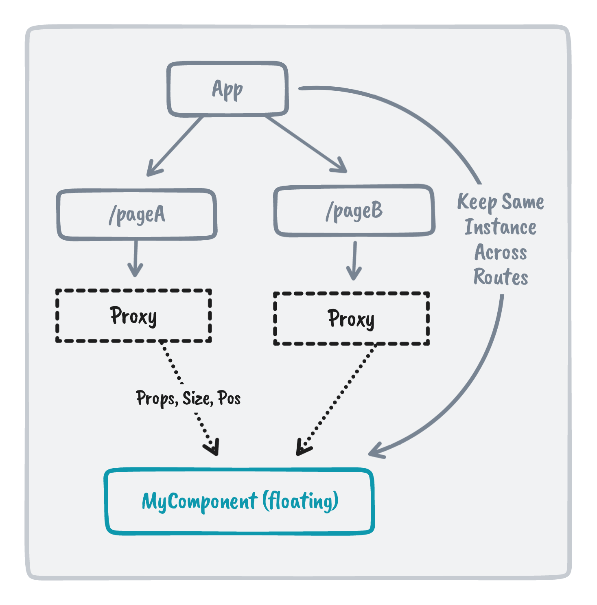
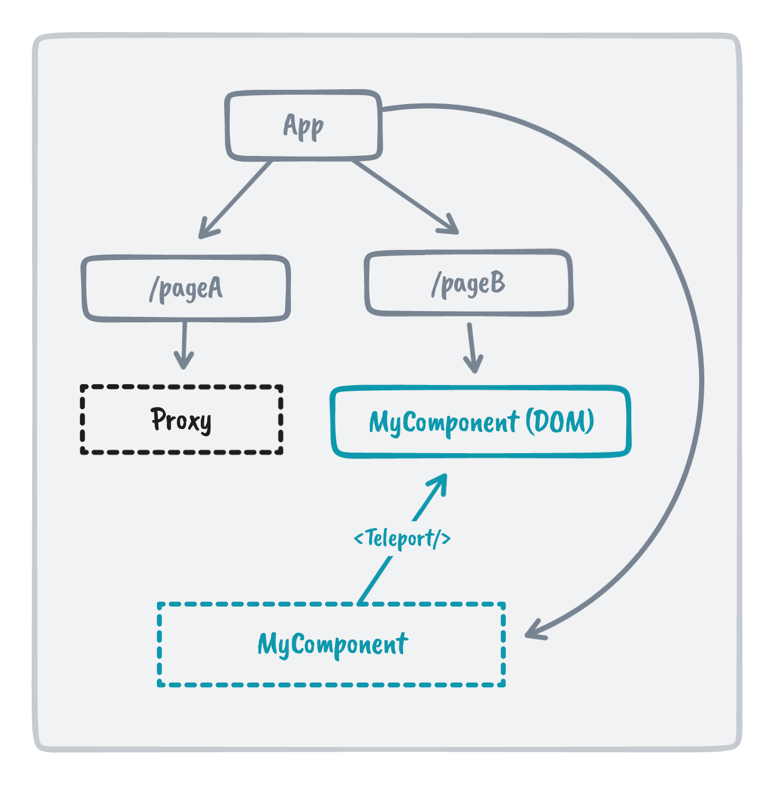

Shared Vue component across routes with animations

 
 

## Why?

It's quite common you might have a same component used in different routes (pages) with a bit different sizes and positions. Sometimes you might want to animate them when user navigates between routes to provide a smooth UX. While you can see such animations in native Apps, it's could be a bit challenging to do it in Web.

Vue's component structure is presented as a **tree**, and the child components are in different nodes with their own instances. Meaning when users navigate between routes, the components are not shared across routes.

It also means that you can't directly animate the changes because they are in two different instances. The good news is, there is a technique called [FLIP](https://github.com/googlearchive/flipjs) to enumerate the transitions between them.

However, FLIP only solves the problem of transitions, the components are still not the same. During the navigation, the internal state of the component will lost.

Thus I am experimenting with this new apporch **Starport** trying to solve this problem.

## How?

So since we can't share the components across different branches of the component tree, we could actually hoist them to the root so they are independent from the routes.

To allow each page to controll it, we introduced a **Proxy component** to present the expected size and position of that component. The proxy will pass the props and position infomation to the actual component and let it "fly over" the proxy with animations.

When it arrived to expected position, it will then "land down" to the actual component using the [`<Teleport/>`](https://vuejs.org/guide/built-ins/teleport.html) component.

After the component is "landed", the DOM tree will be preserved as normal. When navigating to another route, the component then will "lift off" back to the floating state, "fly" to the new proxy's position and "land" again.

This is very similar to [Terran's Buildings](https://starcraft.fandom.com/wiki/Lift_Off) (able to leave the ground and fly to new locations) in [StarCraft](https://starcraft2.com/). It's also why this project is named as [**Starport**](https://starcraft.fandom.com/wiki/Starport).

## Usage

> TODO

## License

[MIT](./LICENSE) License © 2022 [Anthony Fu](https://github.com/antfu)

